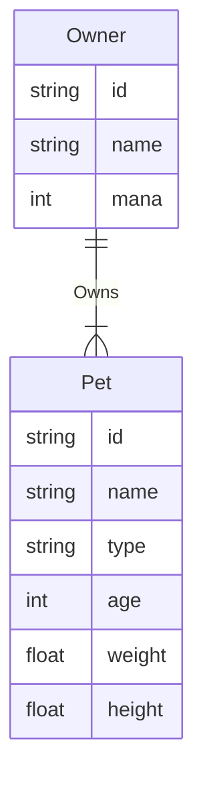

> ⚠️ **Note: This is only a development version.**

# Database Performance Comparison 🚀

This project provides a UI to compare database operation speeds between MongoDB and PostgreSQL. It uses Owner and Pet entities to represent typical application data models.

## Overview

- Frontend built with **Svelte** in `/petfinder` 💻
- Java backend API with Spring Boot in `/backend` ☕
- Databases provisioned via **Docker Compose**:
  - MongoDB 🍃
  - PostgreSQL 🐘
- Supports creating test data and timing the following operations:
  - Insert ✨
  - Find by name 🔍
- Provides visual result comparison with **D3 bar chart** 📊

## Running the Project

To start the project:

1. Clone the repository
2. Navigate to the root directory with the `docker-compose.yml` file
3. Run `docker-compose up` to launch MongoDB, PostgreSQL
4. With an IDE of your choice start the Java Spring Application
5. In a separate terminal, navigate to `/petfinder`
6. Run `npm install` to install dependencies
7. Run `npm run dev` to launch the Svelte frontend on localhost
8. Access the app at `http://localhost:5173` 🌐

The homepage provides controls to:

- Specify insert or find operation
- Toggle between native MongoDB and MongoDB with references for object mapping
- Input parameters like amount to insert or name to find
- Display performance comparison chart with D3

Additional sections could cover:

## Database-Model

## Performance Results

- More details on the performance test flows 📈

Excellent suggestion! Here is an updated "Areas for Enhancement" section focusing on expanding the frontend CRUD capabilities:

## Areas for Enhancement (Please PR🥺)

Some areas that could be expanded on:

### Frontend CRUD Functionality

- Support updating existing owners 🔄
- Implement deleting owners ❌
- CRUD operations for pets 🐾
- Manage relationships between owners and pets 💑

This would build out the Svelte frontend to have full CRUD (Create, Read, Update, Delete) coverage for interacting with the owners and pets test data.

Additional ideas could include:

- Visualize performance over time as additional records are inserted 📈
- Compare indexing approaches like MongoDB compound indexes vs PostgreSQL B-trees 🌲
- Containerization of frontend and deployment optimizations 🐳
